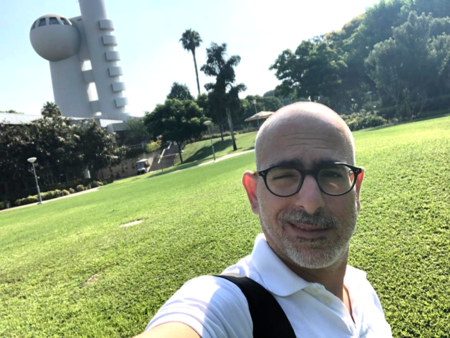

# Adi Moskovits
## Entrepreneur, Educational-Psychology researcher, lecturer and teacher.  Founded _Hippocampus_,  loves nature, jazz, art and the sea.

Hey, my name is **Adi Moskovits**, 
and I am a PhD student in Educational-Psychology or Cognitive-Psychology, in [prof. David Fortus](https://www.weizmann.ac.il/ScienceTeaching/Fortus/home-0) group, in the department of Science Teaching in the Weizmann Institute of Science. In my research I focus on the characterization of a model describing the main emotional pathways related to learning and how they work together, with emphasis on interest as the key factor that initiates the hole process. The model describes the affective cascade responsible to the learning instinct, which include: Interest, Curiosity, Motivation, Engagement, Self-efficacy, Attitudes And of course the learning outcomes. Most of the data is derived from large-scale quantitative analysis of psychological surveys, triangulation of the data with qualitative tools, and cross-referencing it with biological/physiological information such as emotional hormones (like dopamine), fMRI data, etc.

Apart from my research, I really enjoy teaching. as a matter of fact, when i come to think about it, a have been teaching in one way or another for my hole adult life.
these days, I teach once-twice a week in the [MAROM school for gifted and excellent students in Ashdod](https://www.marom-ashdod.co.il/). I find the unique experience of teaching these special students is exhilarating, and most satisfying.
You can read more about my ideas and journey as a teacher in the Israeli education system on my blog called ["A Journey Through the Education System"](https://ajourneytotheeducationsystemofisrael.blogspot.com/), though it is written in Hebrew...

**Hobbies**
apart from education and research, some of the thing that will also probably catch my attention are:
*modern art
*jazz music (usually accompanied with a some whiskey or cognac)
*and every activity involving the blue salty water of the seas.
ah, and I also collect postage-stamps. Well- stamp stories to be more precise...
 you can read some more about it on another Blog of mine, called (as expected) ["Stamp Stories"](https://stamp-stories.blogspot.com/), which alas is also written in Hebrew.

**you can find me also on:**
  [Linked-In/adimoskovits](https://www.linkedin.com/in/adimoskovits/)
  [facebook/adi.moskovits](https://www.facebook.com/adi.moskovits)
  [InstaGram/adi.moskovits](https://www.instagram.com/adi.moskovits/)
  and of-course here on [Git-HUB/AdiMosko](https://github.com/AdiMosko)

**Programming PYTHON for beginners course**
  Happy to add this most useful skill to my toolbox,
  here is the link to the [Git-HUB course repository](https://github.com/szabgab/wis-python-course-2024-11)
  and the link to [Mr. Gabor Szabato home page](https://szabgab.com/).
